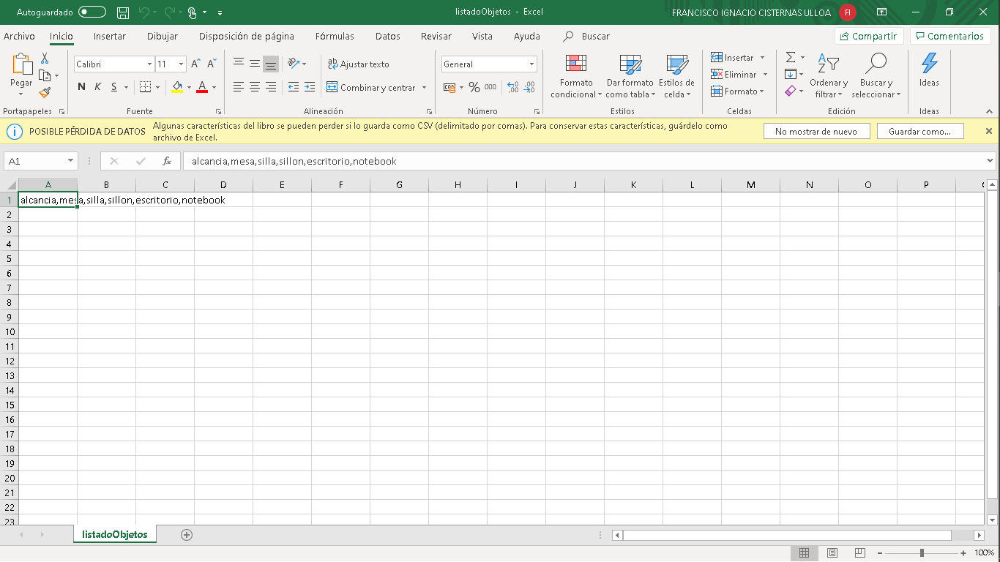
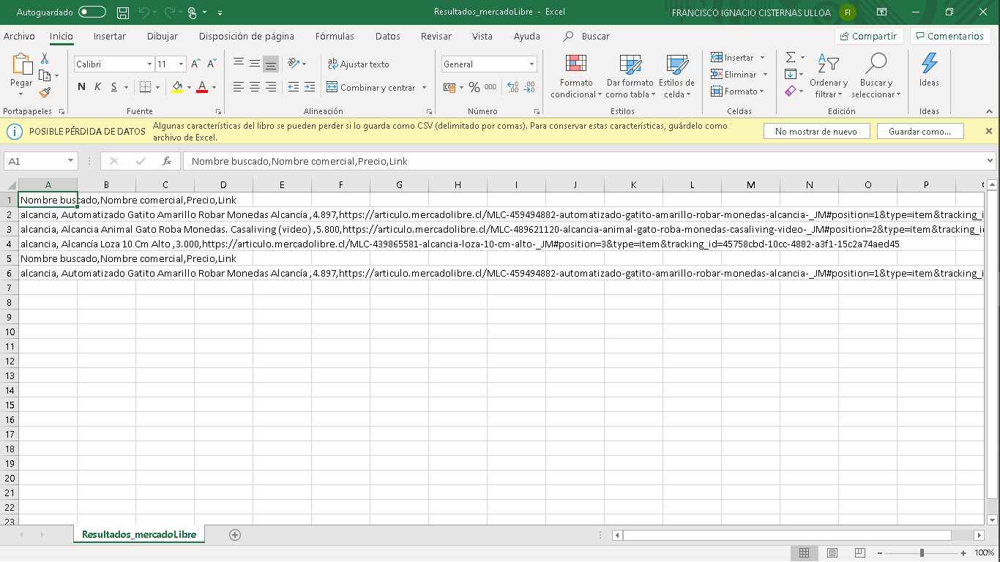

# buscaCosas

Script hecho en python que permite a traves de un archivo csv "lsitadoObjetos" ir a mercado libre y extraer
los precios el nombre el link mas vendidos etc, de los primeros "10" el cual es parametrizado 

instalar python permitir variables de entorno
<code>
pip install requests
pip install lxml

python mercadolibreScrapperV0.1.py

</code>
